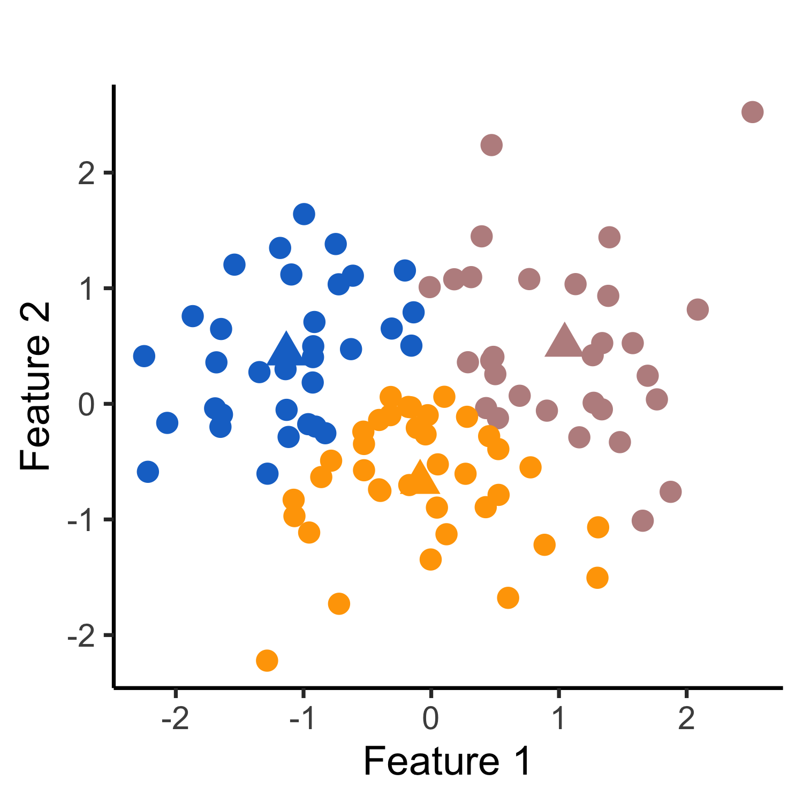

# KmeansInference 

### What is KmeansInference?

`KmeansInference` is an `R` package for testing for a difference in means between clusters of observations identified via k-means clustering.

### How do I install the package?

To download (and load) the KmeansInference package, use the code below.
```r
require("devtools")
devtools::install_github("yiqunchen/KmeansInference")
library(KmeansInference)
```

### Why do we need KmeansInference?

Testing for a difference in means between two groups is one of the most fundamental task in statistics, with numerous applications. If the groups under investigation are *pre-specified*, i.e., without making use of the observed data, then classical hypothesis tests will control the Type I error rate. 

However, in practice, data analysts often find themselves testing the null hypothesis of a difference in means between two groups that are *defined through the same data* used for testing, e.g., via the output of a clustering algorithm. For instance, in single-cell RNA-sequencing analysis, researchers often first cluster the cells, and then test for a difference in the mean gene expression levels between the clusters to quantify up- or down-regulation of genes and identify new cell types. In this case, because the groups are defined through the data, classical hypothesis tests lead to an *inflated Type I error*.

In particular, the inferential challenges resulting from testing data-guided hypotheses have been described as a "grand challenge" in the field of genomics (Lähnemann et al., 2020), and papers in the field continue to overlook this issue: as an example, seurat (Stuart et al., 2019), the state-of-the-art single-cell RNA sequencing analysis tool that has been cited more than 3,900 times since 2019, tests for differential gene expressed between groups obtained via clustering, with a note that "*p-values [from these hypotheses] should be interpreted cautiously, as the genes used for clustering are the same genes tested for differential expression.*"

In this work, we propose a test for a difference in means between two clusters estimated from applying **k-means clustering**. Given a set of observations, suppose that we first apply apply the k-means clustering to obtain clusters. We might then consider testing the null hypothesis that the mean is the same across two *estimated clusters*. As an example, consider a simulated data set where $x_1,\ldots,x_{150} \sim \mathcal{N}(\textbf{0}_{2},\textbf{I}_{2})$, and applying the k-means clustering with K=3 yields three clusters (see leftmost panel of Figure 1). In the middle panel, we display the quantiles of the Wald p-value for testing the null hypothesis that a randomly chosen pair of *estimated clusters* have the same mean. Because the Wald p-value does not account for the fact that the cluster labels are obtained through the same data used for testing, the test based on it leads to an extremely inflated Type I error. By contrast, our selective p-value, conditional on the event that k-means clustering yields the two estimated clusters under investigation, leads to a correctly-sized test (see the rightmost panel of Figure 1). More detailed simulation results can be found in Section 2 of our manuscript.




<!-- [Figure 1: (a): The piecewise mean structure of $\beta$ according to a two-dimensional grid graph. (b): Under the null hypothesis, both $p_{\text{Hyun}}$ and $p_{C_1,C_2}$ control the selective Type I error, but the z-test $p_{\text{Naive}} = \mathbb{P}(|\nu^\top Y|\geq |\nu^\top y|)$ leads to inflated selective Type I error. (c): For a given value of the effect size ($|\nu^\top\beta|/\sigma$), $p_{C_1,C_2}$ has higher power than $p_{\text{Hyun}}$. Power for both increases as a function of the effect size.] -->

### Link to additional resources
* You can learn more about the technical details in our manuscript and in the [technical details section](https://yiqunchen.github.io/GFLassoInference/articles/technical_details.html).
* You can learn more about how to use our software in the  [tutorials section](https://yiqunchen.github.io/GFLassoInference/articles/Tutorials.html).
* Finally, code and steps to reproduce the figures in our manuscript can be found in the GitHub repo [https://github.com/yiqunchen/GFLassoInference-experiments](https://github.com/yiqunchen/GFLassoInference-experiments).

### Citation

If you use `KmeansInference` for your analysis, please cite our manuscript:

Chen YT,  Witten DM. (2022+) Selective inference for k-means clustering. arXiv preprint. https://arxiv.org/abs/xxxx.xxxxx.
 
### Bug Reports / Change Requests

If you encounter a bug or would like to make a change request, please file it as an issue [here](https://github.com/yiqunchen/KmeansInference/issues).

### References

Chen YT,  Witten DM. (2022+) Selective inference for k-means clustering. arXiv preprint. https://arxiv.org/abs/xxxx.xxxxx.

Fithian W, Sun D, Taylor J. (2014) Optimal Inference After Model Selection. arXiv:1410.2597 [mathST].

Gao, L. L., Bien, J., and Witten, D. (2022+). Selective inference for hierarchical clustering. arXiv:2012.02936.

Lähnemann, D., Köster, J., Szczurek, E., et al. (2020). Eleven grand challenges in single-cell data science. Genome Biology, 21(1):31.

Stuart, T., Butler, A., Hoffman, P., et al. (2019). Comprehensive integration of Single-Cell data. Cell, 177(7):1888–1902.e21.

